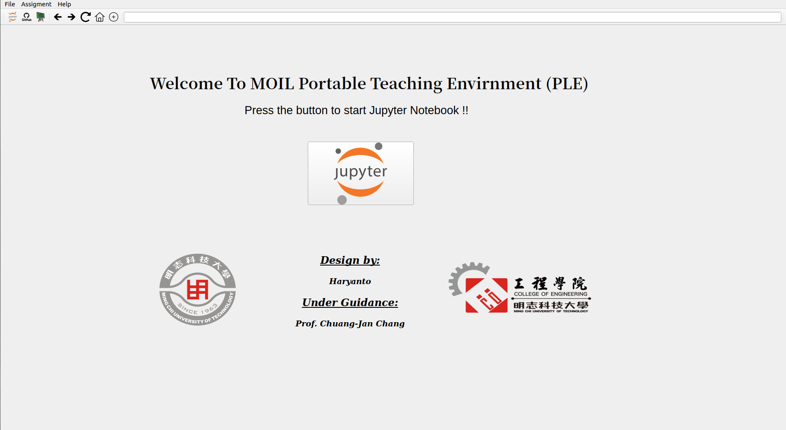
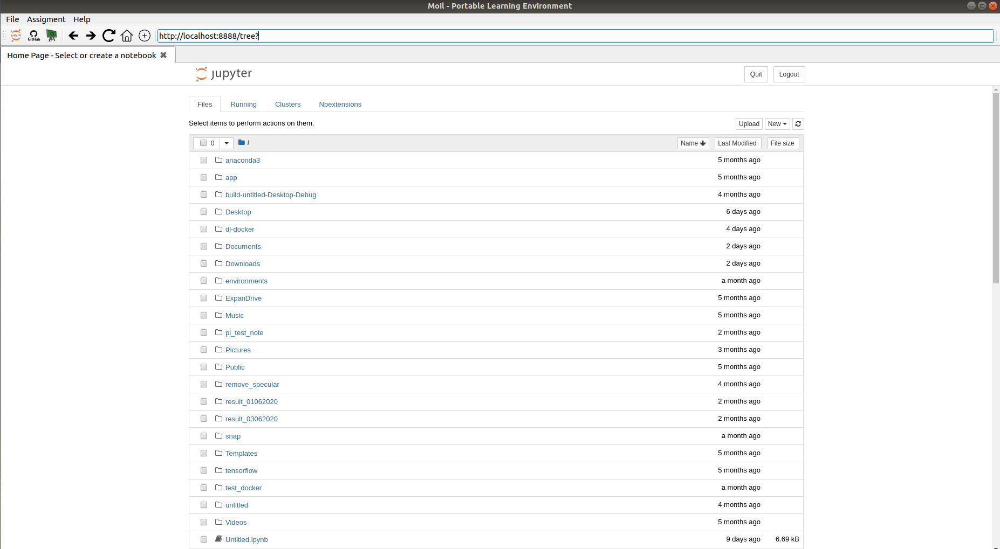
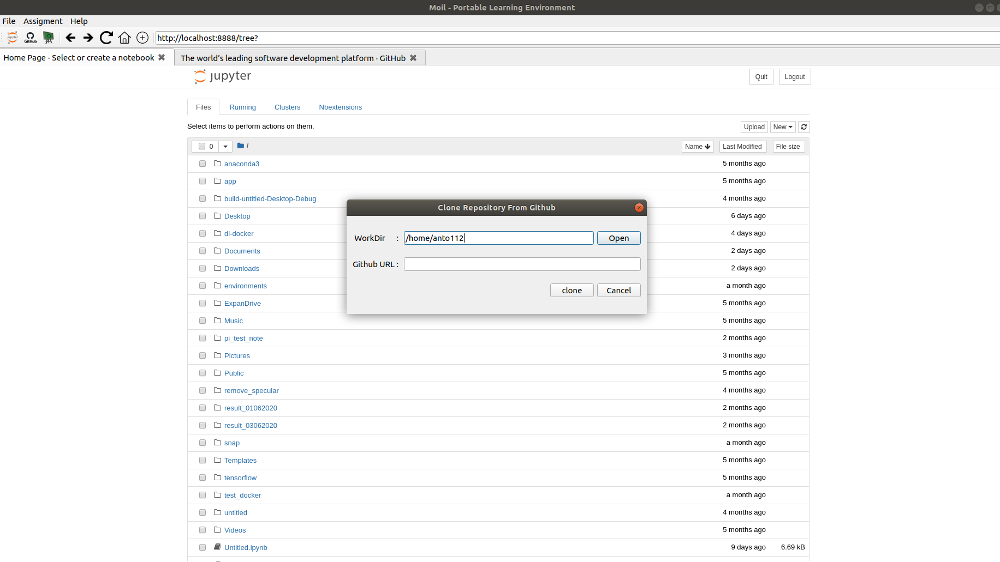

# MOIL Portable Learning Environment (PLE)
**Main Window**







### Installation and Usage

Running Locally Via GitHub (no install)

```
$ git clone https://github.com/anto112/moil-ple.git
$ cd moil-ple
$ pip install -r requirements.txt
$ python main.py
```

- *Design by: Haryanto*
- *Under guidance: Prof. Chuang-Jan Chang*
